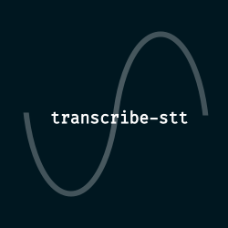

# transcribe-stt

Transcribe audio of any length using Google's Speech to Text API

## Contents

- [Description](#description)
- [Installation](#installation)
- [Reference](#reference)
- [Google authentication](#google-authentication)
- [Converting audio to WAV file](#converting-audio-to-wav-file)
- [To do](#to-do)

## Description

Transcribe audio of any length using [Google's Speech to Text API] with its [`Node client`](https://www.npmjs.com/package/@google-cloud/speech)

## Installation

```
npm i transcribe-stt
```

## Reference

See the [reference documentation](https://github.com/EmmaGoodliffe/transcribe-stt/blob/master/docs/md/index.md)

## Google authentication

To stream any audio, you must authenticate yourself with Google. To do this, just follow the steps below

1. Complete step 1 (only) of [Google's "quickstart" guide](https://cloud.google.com/speech-to-text/docs/quickstart-client-libraries#before-you-begin) to create a GCP project and a private key. Save the private key in your project. (In this guide, we will call it `key.json`)
1. Make sure any repo utilities ignore your new JSON key, e.g. by adding it to a `.gitignore`:
   ```
   key.json
   ```
1. Change the value of the environment variable `GOOGLE_APPLICATION_CREDENTIALS` to the **absolute** path to your JSON key. There are multiple ways to do this. The easiest way is probably directly through [`Node`]

   - Directly through [`Node`]

     1. Before using any `transcribe-stt` services, define the environment variable

        ```ts
        import { resolve } from "path";
        // Or in JavaScript: const { resolve } = require("path");

        const filename = resolve(__dirname, "./key.json");
        process.env.GOOGLE_APPLICATION_CREDENTIALS = filename;
        ```

        Define the relative path relative to the directory that the script is in.

     1. Done!

   - [`dotenv`] (a package for easily defining environment variables)

     1. Create a file called `.env` and add it to any `.gitignore`/etc in the same way as the JSON key
     1. In your `.env`, add a line as follows, replacing `PATH` with the absolute path to your JSON key
        ```
        GOOGLE_APPLICATION_CREDENTIALS=PATH
        ```
     1. Install [`dotenv`]
        ```
        npm i dotenv --save-dev
        ```
     1. Configure [`dotenv`] before using any `transcribe-stt` services

        ```ts
        import { config } from "dotenv";
        // Or in JavaScript: const { config } = require("dotenv");

        config();
        ```

     1. Done!

   - Command-line/shell
     1. Define environment variable, replacing `PATH` with the absolute path to your JSON key
        - Linux/macOS
          ```
          export GOOGLE_APPLICATION_CREDENTIALS="PATH"
          ```
        - Windows
          - PowerShell
            ```
            $env:GOOGLE_APPLICATION_CREDENTIALS="PATH"
            ```
          - Command prompt
            ```
            set GOOGLE_APPLICATION_CREDENTIALS=PATH
            ```
     1. Done!

## Converting audio to WAV file

To use an audio file with `transcribe-stt`, it must be a WAV file with mono audio. This is a simple guide to converting audio files with an editor, specifically [Audacity] which is free and available on all 3 major operating systems. However, many of the steps will be very similar on any audio editing software

1. Open the editor and import your audio
   > File > Import > Audio...
1. Select all
   > Select > All
1. Convert to mono if necessary
   > Tracks > Mix > Mix Stereo Down to Mono
1. Optionally check or change the sample rate (and remember it for later)
   > Tracks > Resample...
1. Export as WAV file
   > Export > Export as WAV
1. Optionally change the encoding. When the export dialogue appears, there is an option to "Save as type" where you can choose what encoding you want (and remember it for later). Learn more about encodings [below](#encoding)

## To do

- Create development guide
- Use docker
- Document how to change to a WAV file programmatically
- Allow advanced configuration options documented [here](https://cloud.google.com/speech-to-text/docs/reference/rpc/google.cloud.speech.v1#google.cloud.speech.v1.StreamingRecognitionConfig)
- Check exports from `.ts` files are used
- Add `data` event for `DistributedSTTStream`
- Post-process `.md` files

[audacity]: https://www.audacityteam.org/
[`dotenv`]: https://www.npmjs.com/package/dotenv
[google's speech to text api]: https://cloud.google.com/speech-to-text/
[`node`]: https://nodejs.org/
